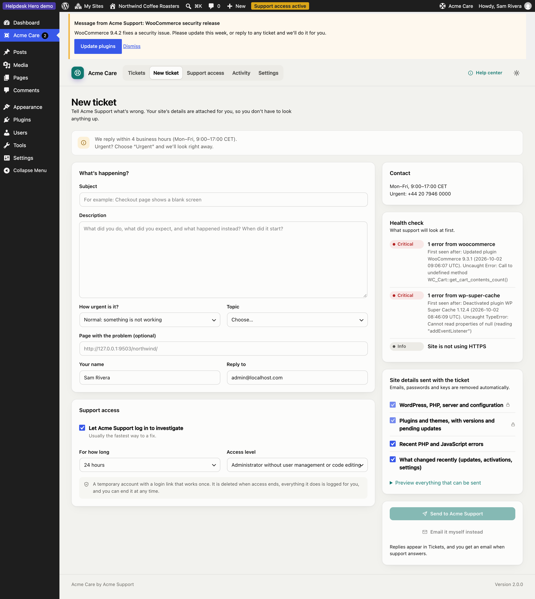
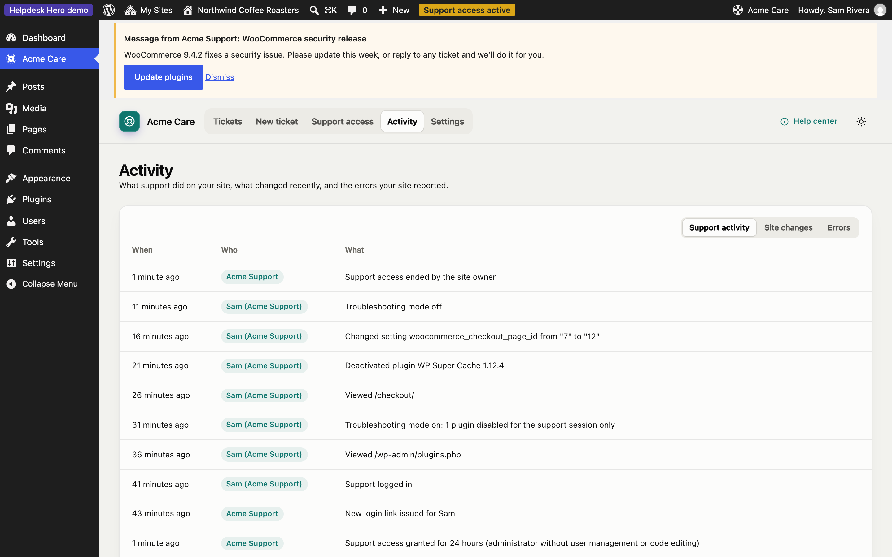
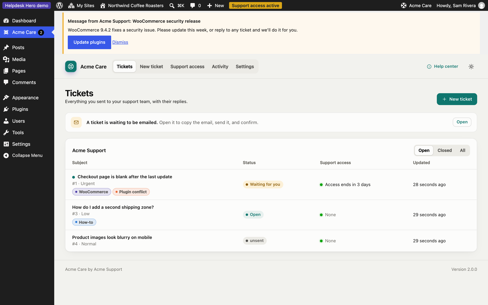
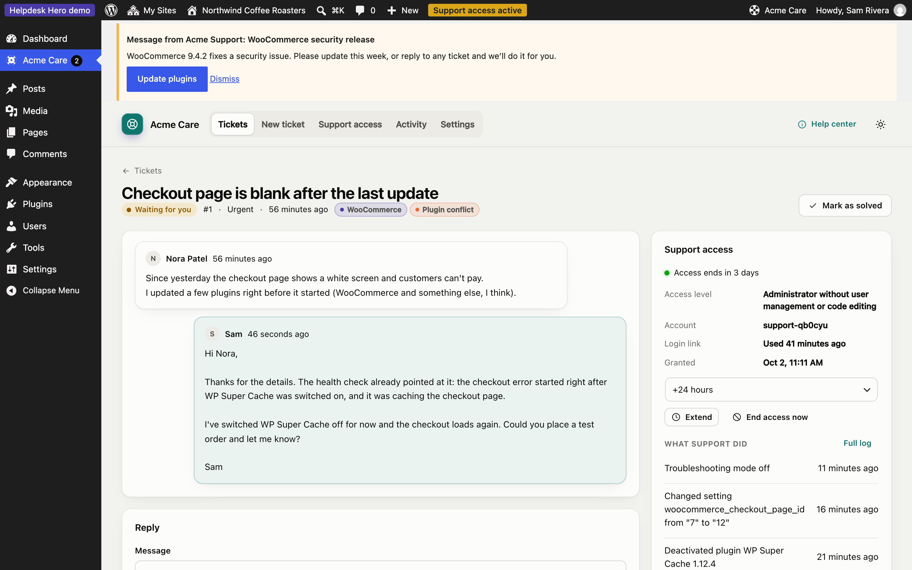
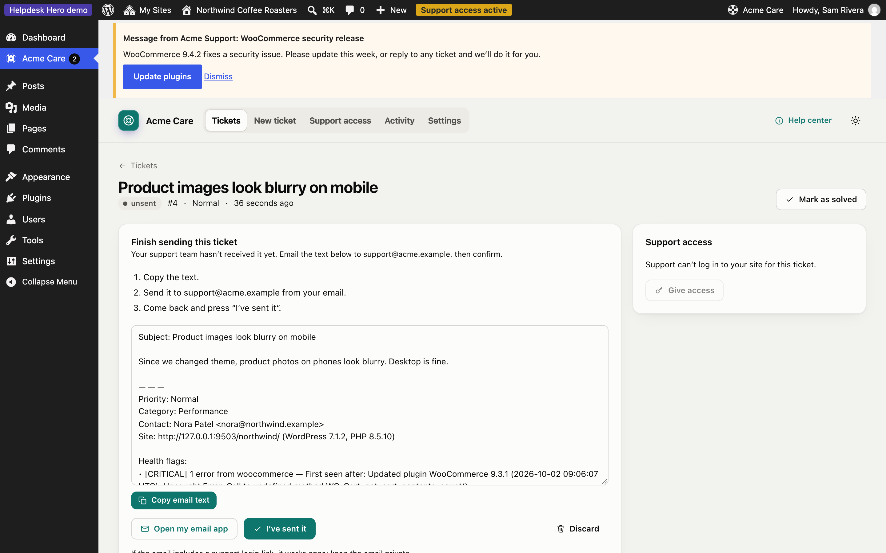
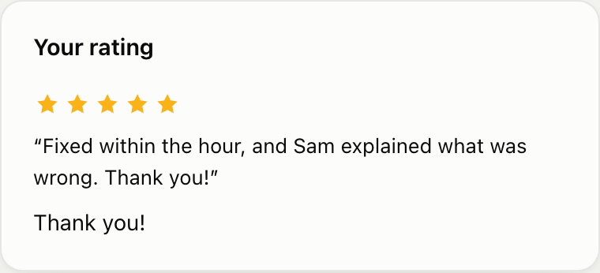

# For your customers

This page is written for your customers. You can send them the link: it explains what the free **Helpdesk Hero** plugin does on their site.

## Connect to your support team

1. In your WordPress dashboard, go to **Plugins → Add New**, search for **Helpdesk Hero**, then install and activate it.
2. Open **Get Help** in the menu (your support team may have given it their own name).
3. Paste the connection code your support team sent you and click **Connect**.

Nothing is sent until you open a ticket, and you always see what will be sent first.

## Open a ticket

Click **New ticket**, describe the problem, and choose a category and priority if asked.

If your support team allows it, **Help me describe this** turns your notes into a clear report using your site's AI provider. No AI account? The free AI Provider for WebLLM runs a model privately in your browser: see [Private AI with WebLLM](local-ai.md).

Below the form you'll see what will be sent with your ticket: your WordPress and PHP versions, plugins, recent errors and changes, and a health check. Passwords and keys are never sent, and email addresses are masked. Your support team decides which parts are required; you can untick the others.

## Give support access (optional)

Tick **Let [your support team] log in to investigate** to let them log in and fix things. They get a temporary account, with no password, that ends on its own. You choose how long (within your support team's limits), and you can end it at any time from the ticket or **Support access**.

Everything they do while logged in is listed under **Activity**: pages they visited, settings they changed, plugins they switched on or off.

## Follow your tickets

**Tickets** lists everything you sent, with your support team's replies and tags.

Open a ticket to read replies, answer, give or extend access, or mark it as solved.

## Email a ticket yourself

If your support team allows it, you can click **Email it myself instead** rather than sending a ticket from the dashboard. Helpdesk Hero prepares the email for you:

1. Copy the email text (or click **Open my email app**).
2. Send it to the address shown.
3. Come back and click **I've sent it**.

The email text stays on the ticket, so you can copy it again later.

## Rate your support

When a ticket is closed or you end support access, you may be asked to rate your experience with one to five stars and a short comment. Your support team sees it on the ticket.

## Disconnect

Under **Settings**, **Disconnect** ends the connection to your support team. Any active support access ends at once. Your past tickets stay on your site.
