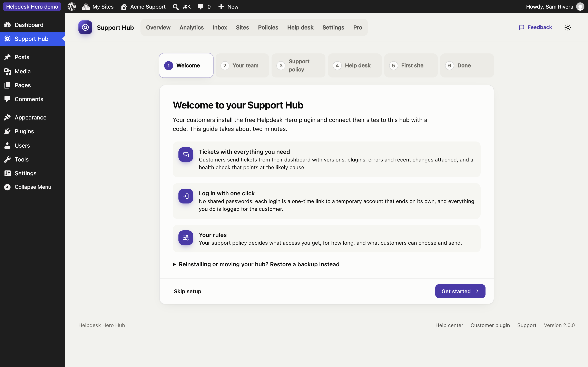
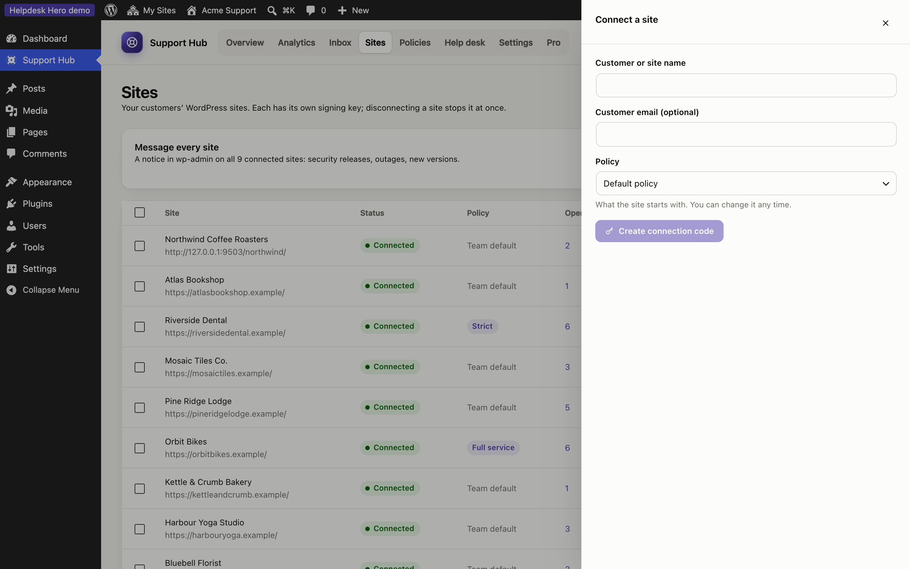

# Getting started

Helpdesk Hero has two free plugins and an optional add-on:

| Plugin | Where it goes | What it does |
|---|---|---|
| **Helpdesk Hero Hub** | Your support team's own WordPress site | The inbox for every connected site, your support policy, site access, statistics |
| **Helpdesk Hero** | Each customer's site | A help center in their dashboard: tickets with diagnostics, temporary access for you, activity log |
| **Helpdesk Hero Pro** (optional) | Your hub site, next to the hub | Advanced analytics with PDF reports, white label, ratings, supporters, AI triage, agent role (Help Scout and Zendesk coming soon) |

Customers never choose a hub themselves. They connect only with a code you give them, and your hub decides the rules.

> **Try it first.** The [live demo](https://george-stathopoulos.github.io/helpdesk-hero/demo/) opens a hub and a customer site in your browser, with example tickets, in about a minute. Nothing to install.

## Install the hub

1. On your support team's WordPress site, go to **Plugins → Add New**, search for **Helpdesk Hero Hub**, then install and activate it.
2. The setup guide opens. It takes about two minutes.

## The setup guide

The guide has six short steps:

1. **Welcome:** what the hub does.
2. **Your team:** the team name customers see ("Acme Support") and the email address that gets new tickets and replies.
3. **Support policy:** start from a template (Standard, Hands-off, Strict or Full service). You can change everything later under [Policies](policies.md).
4. **Help desk:** tickets go to the hub inbox and your team email. Help Scout and Zendesk are coming soon with [Pro](pro.md).
5. **First site:** create a connection code for your first customer.
6. **Done.**

You can leave the guide at any time with **Skip setup**, and come back to it from the Overview.

## Connect your first customer site

1. In the hub, open **Sites** and click **Connect a site**.
2. Enter the customer's name (and email, if you like) and choose the policy that site should use.
3. Copy the connection code. It starts with `hdh1.` and works for 7 days.
4. Send the code to your customer with these instructions: install **Helpdesk Hero** from WordPress.org, open **Get Help** in the dashboard, paste the code and click **Connect**.

When the customer connects, the site shows up under Sites as **Connected**, and their help center takes your team's name and your rules. See [Connecting sites](sites.md) for details.

## What happens next

- The customer opens a ticket from their dashboard. Their WordPress version, plugins, theme, recent errors and recent changes are attached, with a health check that points at likely causes.
- The ticket arrives in your [Inbox](inbox.md). You get an email.
- If the customer allowed it, you click **Log in** and you're in their site, with a temporary account that ends on its own. See [Site access](site-access.md).
- You reply in the hub. The customer sees your reply in their dashboard and by email.
- When the ticket is closed, the customer can rate it.

## Requirements

- WordPress 6.5 or newer, PHP 7.4 or newer, on both the hub and customer sites.
- The hub and the customer sites must be able to reach each other over HTTPS (the WordPress REST API must not be blocked).
- AI features are optional and need WordPress 7.0's AI Client with a connected provider.
