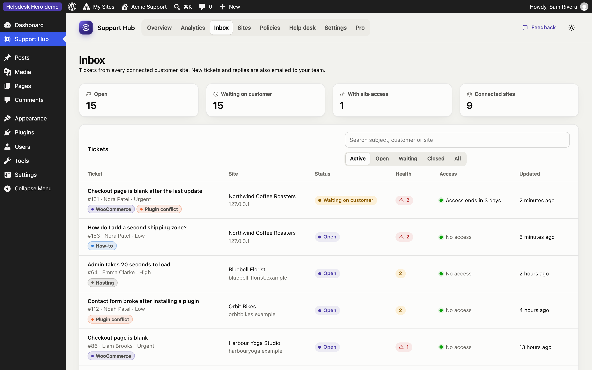
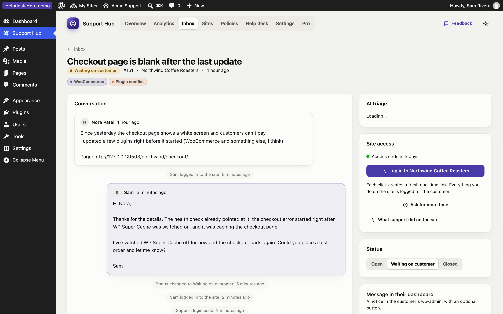
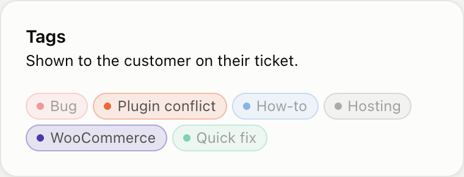
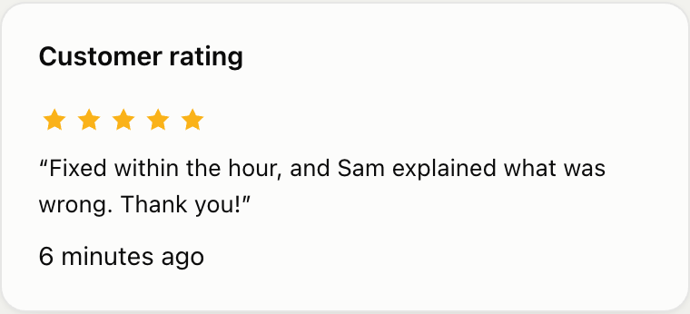

# Inbox and tickets

The **Inbox** lists tickets from every connected site. Open tickets and tickets waiting on the customer are shown first; use the filters for **Closed** or **All**, and the search box to find a subject, customer or site.

Each row shows the site, the status, how many health check findings the ticket has (red for critical), whether you have access to the site right now, and when it was last updated. Tickets the customer emailed themselves are marked **Emailed** (see [Emailed tickets](#emailed-tickets)).

## A ticket

The ticket page has everything in one place:

- **Conversation:** the customer's description, your replies and their replies, oldest first.
- **Reply to the customer:** your reply appears in their dashboard and is emailed to them. Replying sets the ticket to **Waiting on customer**.
- **Health check:** the findings from the customer's site when the ticket was sent, most serious first, for example "3 errors from WooCommerce, first seen after: Updated plugin WooCommerce 9.3.1".
- **Diagnostics:** the full environment, plugin list, errors and recent changes, in sections you can expand.
- **Site access:** log in with one click, ask for more time, and see what your team did on the site. See [Site access](site-access.md).
- **Status:** Open, Waiting on customer or Closed. The customer sees the same status.
- **Message in their dashboard:** a notice at the top of the customer's WordPress dashboard, with an optional button (for example "Update plugins").
- **Tags** and **Details** (customer, site, priority, category, WordPress and PHP versions).

## Tags

Tags help you sort tickets and spot patterns: *Bug*, *Plugin conflict*, *How-to*, *Hosting*. Click a tag on the ticket to add or remove it.

Customers see the tags on their tickets too, so use names you're happy for them to read. Create, rename and recolour tags under **Settings → Ticket tags**. Renaming a tag updates every ticket that uses it, on the customer's side as well.

## Customer ratings (Pro)

With [Pro](pro.md) and ratings turned on in your [policy](policies.md#tickets), customers are asked to rate their experience when a ticket is closed or when they end your access. They choose one to five stars and can add a short comment. The rating appears on the ticket in the hub:

Ratings also feed the Ratings chart in [Analytics](overview.md#advanced-analytics-pro).

## Emailed tickets

Your policy can let customers email a ticket themselves instead of sending it from the dashboard (for example when their site can't reach the hub). The customer plugin then:

1. Prepares the email text, with the diagnostics included, and shows the steps: copy, send to your support address, come back and confirm.
2. Keeps the ticket as **unsent** until they press **I've sent it**.
3. When they confirm, registers the ticket with the hub, marked **Emailed**, so it shows in your inbox with its diagnostics and access, and isn't created in your help desk a second time.

The email text stays available on the ticket, so the customer can copy it again later.

## Notifications

New tickets and customer replies are emailed to the team email address under **Settings**. The customer is emailed when you reply.

## AI triage (Pro)

With [Pro](pro.md#ai-triage), and WordPress 7.0's AI Client connected on your hub site, every new ticket gets a short brief: what the customer is asking, the likely cause from the diagnostics, suspects, and first steps to try. **Draft with AI** writes a reply you edit before sending. Nothing goes to an AI provider unless triage is on or someone presses an AI button. It works with any provider under **Settings › Connectors**, including the free, local [AI Provider for WebLLM](pro.md#private-local-ai-with-webllm).

On the customer's side, the free plugin has an optional writing assistant that helps customers describe their problem clearly (your policy can turn it off).
