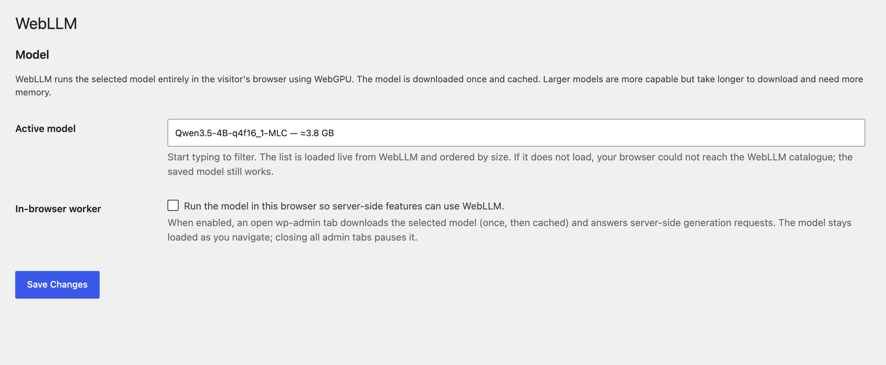

# Private AI with WebLLM

Helpdesk Hero's AI features (the customer's writing assistant, and AI triage and reply drafts in Pro) use whatever AI provider your site has. You don't need a cloud AI account: **AI Provider for WebLLM** runs a language model inside your own browser.

- **No API key and no bill.** The model runs on your computer's graphics chip (WebGPU).
- **Private.** Prompts and answers stay in your browser and your site. Nothing is sent to an AI company.
- **Free and open source** (GPL), created by Joost de Valk and published by [Progress Planner](https://progressplanner.com/). Helpdesk Hero isn't affiliated with it; we recommend it because it fits how we think AI should work in WordPress.

Project page: [github.com/ProgressPlanner/ai-provider-for-webllm](https://github.com/ProgressPlanner/ai-provider-for-webllm)

## What you need

- **WordPress 7.0 or newer** (it uses the AI Client built into WordPress 7.0).
- **HTTPS** (or `localhost` on a development site). Browsers only allow WebGPU on secure pages.
- **A browser with WebGPU**: recent Chrome or Edge on desktop work best.
- **Space and memory for the model.** Models download once (from a few hundred MB to a few GB, depending on the model) and are then cached by the browser. Smaller models are faster and lighter.

## 1. Download

The plugin isn't on WordPress.org yet, so you download it from GitHub:

1. Open [the project on GitHub](https://github.com/ProgressPlanner/ai-provider-for-webllm).
2. Click the green **Code** button, then **Download ZIP**. You get a file such as `ai-provider-for-webllm-main.zip`. Don't unzip it.

## 2. Install and activate

1. In your WordPress dashboard, go to **Plugins → Add New → Upload Plugin**.
2. Choose the zip you downloaded and click **Install Now**.
3. Click **Activate Plugin**.

On a support hub, install it on the hub site. On a customer site, the site owner installs it there for the writing assistant.

## 3. Choose a model and turn on the worker

1. Go to **Settings → WebLLM**.
2. Pick a **Model**. The list comes from WebLLM's catalogue, smallest first. Start with a small one (around 1 billion parameters); you can switch later.
3. Turn on **In-browser worker**. Helpdesk Hero needs this: its AI requests start on your server, and the worker lets an open dashboard tab answer them.
4. Click **Save Changes**.

The first time a model is used, your browser downloads it. Keep the tab open until it's done; it's cached after that.

## 4. Check that it works

1. Stay on **Settings → WebLLM**. The status line should read **WebLLM worker: ready** (after *loading model…* the first time). If it says *unavailable*, see [Troubleshooting](#troubleshooting).
2. **On a support hub (Pro):** open **Support Hub → Pro**. The AI triage card no longer asks you to connect a provider. Open any ticket and click **Write it** in the AI triage card. A brief appears after a few seconds (longer the first time, while the model loads).
3. **On a customer site:** open the help center's **New ticket** screen. **Help me describe this** appears under the description when your support team's policy allows the writing assistant.

Helpdesk Hero also tells you what's missing: if the plugin is installed but not active, or active with the worker off, a note says so where the AI features are.

## How it behaves

- **Keep a dashboard tab open** while you use AI features. With no tab open, there's no browser to run the model, and requests wait and then time out.
- **No background AI.** Scheduled tasks (cron) and WP-CLI have no browser, so with WebLLM active, Pro doesn't write triage briefs automatically when tickets arrive. Open the ticket and click **Write it** instead.
- **Speed depends on your computer.** A laptop with a recent graphics chip answers a short brief in seconds; older machines take longer. Smaller models help.

## Troubleshooting

| What you see | What to do |
|---|---|
| *unavailable — needs a secure context* | Use your site's `https://` address. On a development site, `localhost` works too. |
| *unavailable — WebGPU is not available* | Use a recent Chrome or Edge on a desktop computer, and make sure hardware acceleration is on in the browser's settings. |
| *error: …* while loading a model | The download was interrupted or the device ran out of memory. Reload the page, or choose a smaller model. |
| AI features still say no provider is connected | Check that the plugin is **active**, a model is saved, and **In-browser worker** is on. Then reload the Helpdesk Hero screen. |
| Requests time out | Keep a dashboard tab open and wait for *WebLLM worker: ready*. Very slow devices may need a smaller model. |

For problems with WebLLM itself, see the project's [support page](https://github.com/ProgressPlanner/ai-provider-for-webllm/blob/main/SUPPORT.md).

## Credits

AI Provider for WebLLM was created by Joost de Valk, is published by [Progress Planner](https://progressplanner.com/), and is released under the GPL. It runs models with [WebLLM](https://github.com/mlc-ai/web-llm) by the MLC AI project. Thank you to both.
