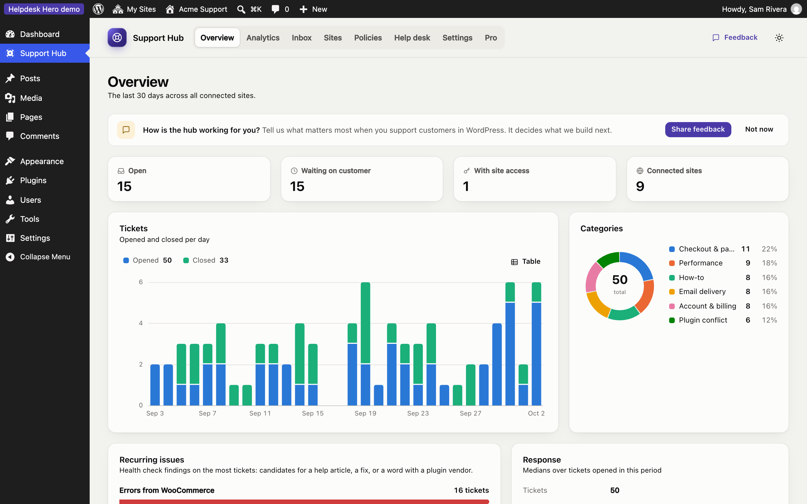
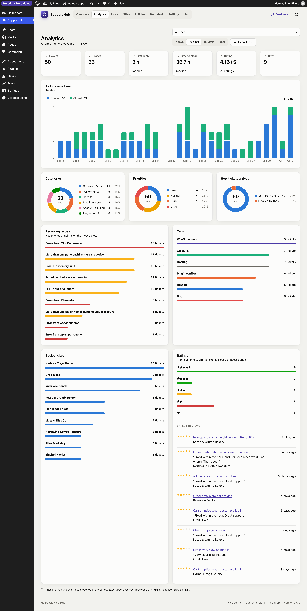

# Overview and statistics

The **Overview** is the hub's home page: what needs you now, and how support went over the last 30 days.

## What it shows

- **Open**, **Waiting on customer**, **With site access** and **Connected sites** right now.
- **Tickets:** opened and closed per day. Hover a day for the numbers, or click **Table** for an accessible table view.
- **Categories:** the share of tickets in each category from your [policy](policies.md#tickets).
- **Recurring issues:** health check findings that appear on the most tickets, such as "Errors from WooCommerce" or "More than one page caching plugin is active". These are good candidates for a help article, a fix in your product, or a word with a plugin vendor.
- **Response:** median time to the first reply and to close.

## Advanced analytics (Pro)

[Pro](pro.md) adds an **Analytics** page with any date range (7 days to a year), filtering **by site**, and more charts:

- tickets over time, per day or per week
- categories, priorities, and how tickets arrived (dashboard or emailed)
- recurring issues and tags
- busiest sites
- customer ratings: average, distribution and recent comments

**Export PDF** creates a clean report of the current view, ready to send to a client (for example a monthly report for a care plan customer). The report is made by your browser's print dialog, so nothing is uploaded anywhere.
