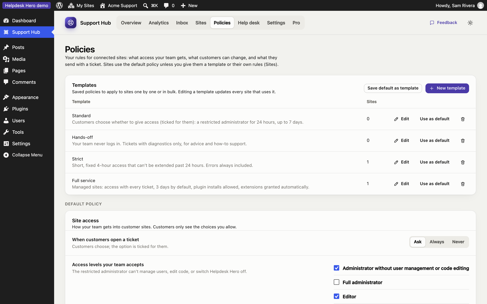
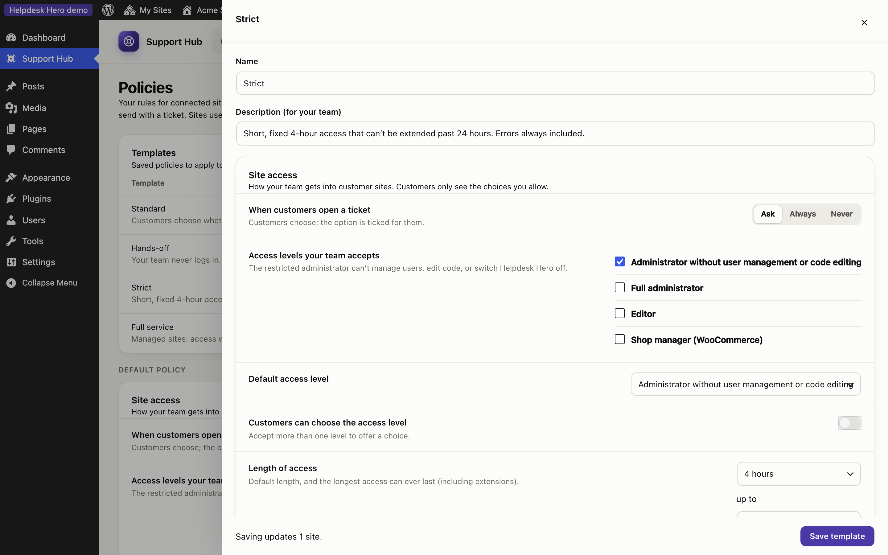

# Policies and templates

Your support policy is the set of rules connected sites follow: what access your team gets, what customers can choose, and what a ticket includes. The customer plugin shows customers only the options your policy allows, and both sites enforce it.

Every site uses one of:

- your **default policy**, the starting point for new sites;
- a **template**, shared by many sites (edit the template and every site using it updates);
- **custom rules** for that site only (set in the site's panel under [Sites](sites.md)).

## Templates

The hub starts with four templates you can edit, copy or delete:

| Template | For |
|---|---|
| **Standard** | Customers choose whether to give access, for up to a week |
| **Hands-off** | No site access, tickets and diagnostics only |
| **Strict** | Short access (4 hours, up to 24), more diagnostics required, customers can't change the duration |
| **Full service** | Access comes with every ticket, for care plans and managed sites |

Click **New template** or **Save default as template** to make your own. Deleting a template moves its sites back to your default policy.

## Site access

| Setting | What it does |
|---|---|
| **Access mode** | *Customers choose* (the option is ticked for them), *Always* (access comes with every ticket) or *Never* |
| **Access levels your team accepts** | The roles customers may give you. The default is an administrator who can't manage users or edit code |
| **Customers can choose the access level** | Otherwise your default role is always used |
| **Default and maximum length** | How long access lasts, and the most a customer can choose |
| **Customers can choose the length** | Otherwise your default duration is always used |
| **Plugin installs** | Whether the support account may install new plugins |
| **More time when your team asks** | Customers approve your requests, or they're granted automatically up to the maximum |
| **Customers can extend access themselves** | Lets customers add time themselves |
| **Log the pages your team visits** | Record every page your team views, not only changes |
| **Troubleshooting mode** | Let your team switch plugins off for their own session |
| **End access when the ticket closes** | Recommended |

## Tickets

| Setting | What it does |
|---|---|
| **Customers can reply from their dashboard** | Otherwise they read your replies there and contact you another way |
| **Customers can close and reopen tickets** | Shows **Mark as solved** |
| **Ask for a priority** | Low, Normal, High, Urgent |
| **Categories** | The categories customers choose from (they also power your statistics) |
| **Note on the New ticket screen** | A short message at the top of the New ticket form, such as your opening hours |
| **Support email** | Lets customers email a ticket themselves when needed. Leave empty to turn this off |
| **Writing assistant** | The customer's optional AI helper for describing a problem |
| **Ask customers to rate support** (Pro) | Ask for a rating when a ticket is closed or access ends |

## Site details sent with tickets

For each section (environment, plugins and theme, errors, recent changes, debug log) choose **Required**, **Ticked** (on, but the customer may untick it), **Unticked** or **Never**. The customer always sees what will be sent before it goes.
