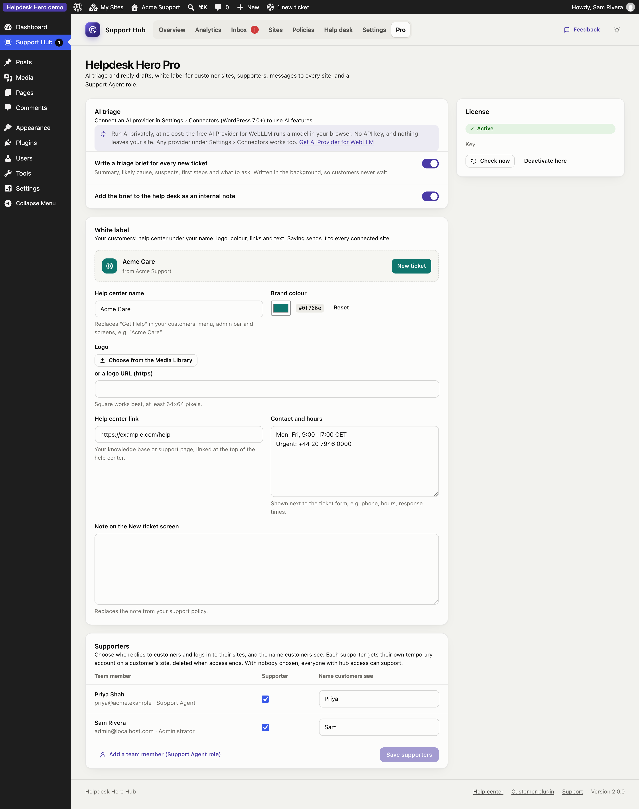
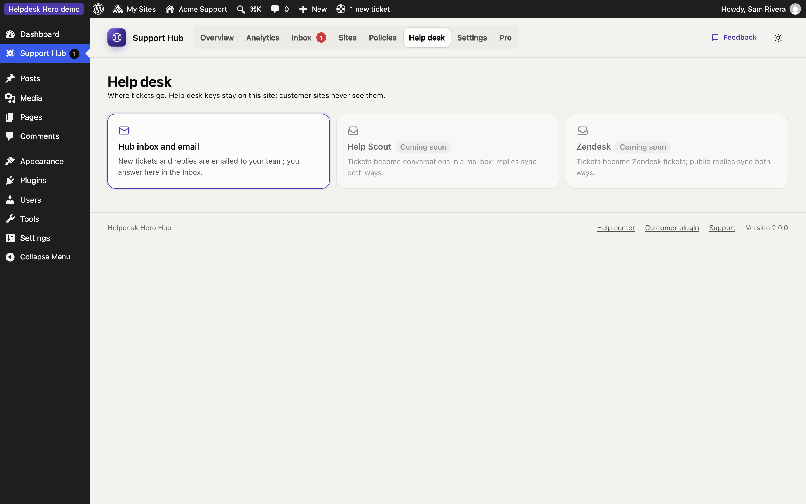
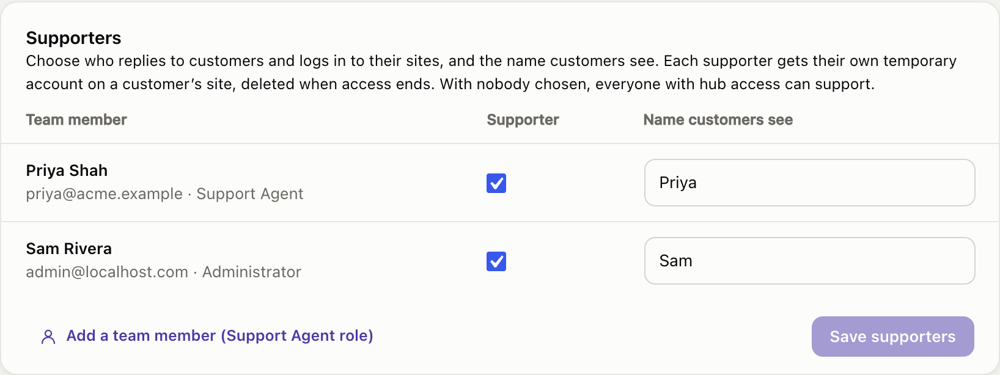

# Helpdesk Hero Pro

Pro is an add-on for the hub. It needs Helpdesk Hero Hub and goes on the same site. Customer sites don't need anything extra: Pro features reach them through the hub.

## Install and activate

1. Download `helpdesk-hero-pro.zip` from your purchase email or account.
2. On your hub site, go to **Plugins → Add New → Upload Plugin**, upload the zip and activate it.
3. Open **Support Hub → Pro** and enter your license key.

If your license expires, Pro features switch off and the free hub keeps working: tickets, sites, policies and statistics are untouched.

## Trying Pro with the TEST key

Enter **TEST** as the license key to switch every Pro feature on without buying a license. Until Helpdesk Hero Pro's store opens, it works on any site. After that it keeps working on test sites only: where WordPress reports a `local`, `development` or `staging` environment (`WP_ENVIRONMENT_TYPE`), on local addresses (`localhost`, `127.0.0.1`, `*.local`, `*.test`) and in WordPress Playground.

## Help Scout and Zendesk (coming soon)

Help Scout and Zendesk connections are being finished. On the **Help desk** page they're shown greyed out as **Coming soon**, and no keys can be entered yet. Until then, the hub inbox and email handle every ticket, with everything else working as described here.

## Advanced analytics and PDF reports

The **Analytics** page adds date ranges, per-site statistics, priorities, tags, busiest sites and customer ratings, and **Export PDF** for client reports. See [Overview and statistics](overview.md#advanced-analytics-pro).

## White label

Put your customers' help center under your own name. Set it under **Pro → White label**, with a live preview of the header your customers see:

- **Help center name:** replaces "Get Help" in the customer's menu, admin bar, header and footer, for example "Acme Care".
- **Brand colour:** buttons, links, highlights and the logo badge.
- **Logo:** choose an image from your Media Library, or paste a logo URL.
- **Help center link:** your knowledge base, linked at the top of the help center.
- **Contact and hours** (opening hours, an urgent phone number), shown next to the ticket form.
- **Note on the New ticket screen**, replacing the note from your support policy.

Saving sends it to every connected site within minutes. The customer's footer then reads "Acme Care by Acme Support" instead of naming Helpdesk Hero.

## Ratings and reviews

Ask customers to rate support when a ticket is closed or when they end your access. Turn it on in your [policy](policies.md#tickets) (**Ask customers to rate support**). Ratings show on tickets and in Analytics.

## AI triage

When WordPress 7.0's AI Client is connected on your hub site, each new ticket gets a brief: the problem in a sentence, the likely cause based on the diagnostics, suspects, and first steps. **Draft with AI** writes a reply from the ticket and the brief, which you edit before sending. Turn **Write a triage brief for every new ticket** off under **Pro** if you prefer to run it by hand.

### Private, local AI with WebLLM

You don't need a cloud AI account: the free **AI Provider for WebLLM** (by Joost de Valk / Progress Planner) runs a model inside your browser, with no API key and nothing sent to an AI company. [Set it up step by step](local-ai.md). With WebLLM, briefs aren't written in the background: open the ticket and click **Write it**.

## Message every site

Send one dashboard message to every connected site, for example about a security update or planned maintenance, with an optional button.

## Supporters

Choose who on your team replies to customers and logs in to their sites, and the name customers see for each person. Set it under **Pro → Supporters**:

- Tick the team members who act as supporters, and give each one the **Name customers see**, for example "Sam" or "Priya from Acme".
- Once anyone is ticked, only supporters can reply, change a ticket's status, send dashboard messages, ask for more time and log in to customer sites. Everyone else with hub access can still read tickets and statistics.
- Replies are signed with the supporter's name.
- When a supporter clicks **Log in**, the customer's site creates a **personal temporary account** for them, such as "Sam (Acme Support)", instead of one shared support account. The customer's user list, admin bar and activity log show exactly who did what.
- When access expires or is ended, **every** account created for it is deleted: the shared one and each supporter's.

With nobody ticked, everyone with hub access can support, under their own WordPress name.

## Support Agent role

Pro adds a **Support Agent** role (**Pro → Supporters → Add a team member**): team members who can use the hub (tickets, sites, site access) without being administrators of your hub site. Combine it with Supporters to decide which of them reply to customers.
