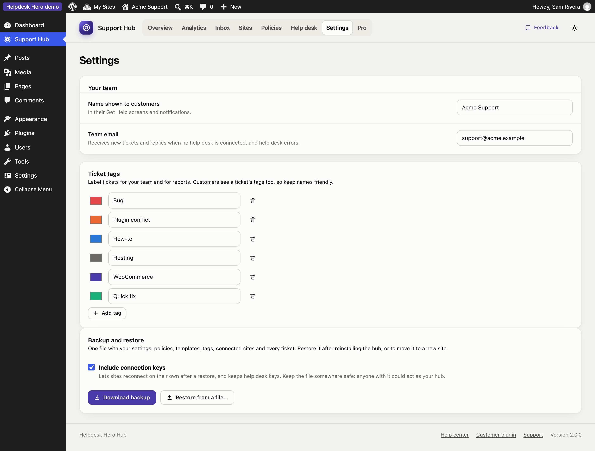
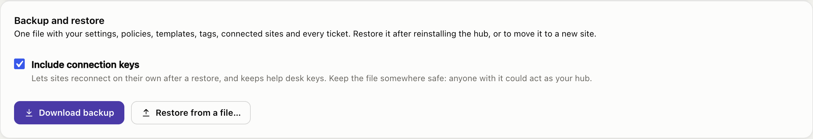

# Settings

**Settings** holds your team details and ticket tags. Your rules for customer sites live under [Policies](policies.md).

## Your team

- **Team name:** shown to customers in their help center ("Connected to Acme Support") and in emails.
- **Team email:** where new tickets and customer replies are emailed. Leave it empty to use the site's admin email.

## Ticket tags

Create the tags your team uses to sort tickets. Each has a name and a colour. Customers see tags on their tickets, so choose names you're happy for them to read. Renaming or recolouring a tag updates every ticket that uses it; deleting a tag removes it from tickets.

## Who can use the hub

In the free hub, administrators use the hub. [Pro](pro.md#support-agent-role) adds a **Support Agent** role, so team members can work tickets without being administrators of your site, and [Supporters](pro.md#supporters), to choose who replies to customers and logs in to their sites, under the name you pick.

## Backup and restore

**Download backup** saves the whole hub as one JSON file: team settings, your policy, templates, tags, every connected site and every ticket with its history. With Pro, its settings, help desk connection and supporters are included too.

- **Include connection keys** (on by default) puts each site's connection key and your help desk keys in the file. Then, after a restore at the same address, every site carries on as before: no new codes, and old tickets keep syncing. Keep the file somewhere safe, because anyone with it could act as your hub.
- **Restore from a file…** replaces everything in the hub with the backup. Use it after reinstalling the hub, or when moving it to a new site. Right after a reinstall, the setup guide also offers **Restore a backup instead**.
- **Moved to a new address?** Customer sites still call the old one, so send each of them a new connection code (their tickets stay on their sites).
- Your Pro license key isn't in the backup: activate it again after a restore. Supporters are matched to your team's user accounts by email address.

Uninstalling the hub deletes everything it stored, so download a backup first.

## The setup guide

You can reopen the setup guide at any time from the Overview. It doesn't change anything until you save a step.
