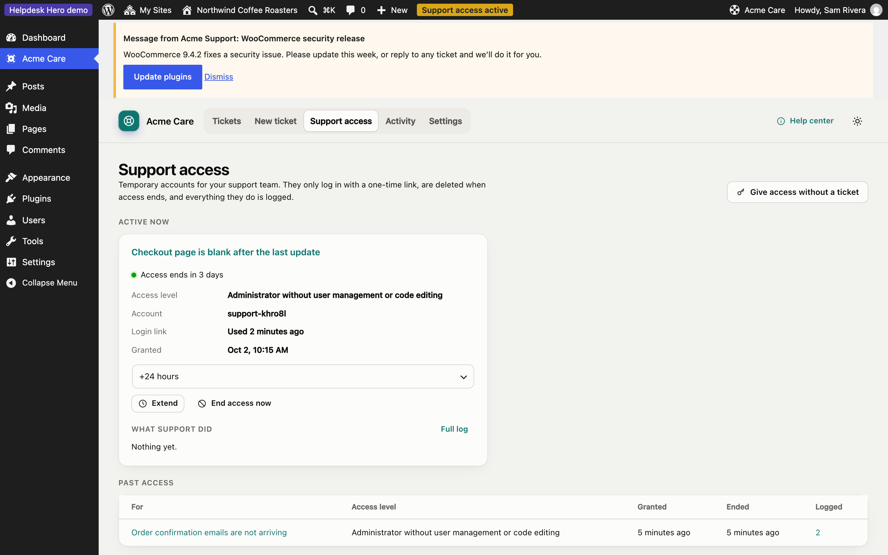
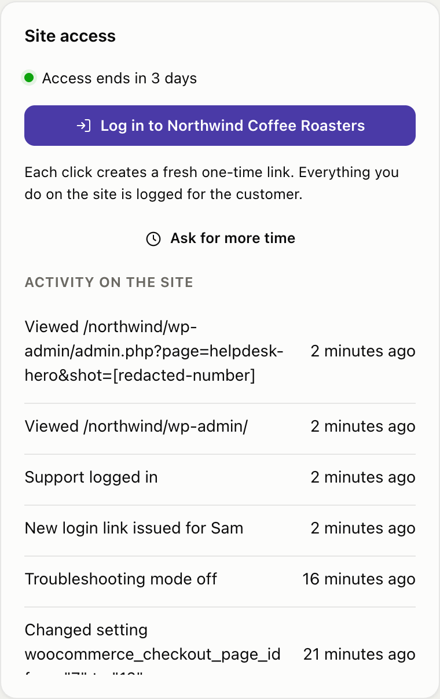
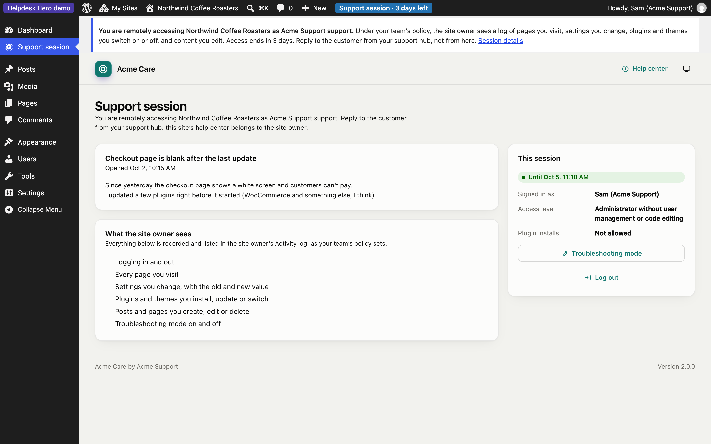

# Site access

Site access lets your team log in to a customer's site without a password. The customer decides whether to allow it, within the limits of your [policy](policies.md#site-access).

## How the customer grants access

When opening a ticket, the customer ticks **Give support access** (pre-ticked if your policy says so) and, if your policy allows, picks how long it lasts and which role you get. Your policy can also make access come with every ticket, or never.

They can also give access later from the ticket, extend it, or end it at any moment under **Support access**.

## Logging in

On the ticket in the hub, click **Log in to [site]**. The hub asks the customer's site for a fresh one-time link and opens it. Each click creates a new link; each link works once.

The account you get:

- has the role from the customer's grant, by default **Administrator without user management or code editing** (it can't create users, change roles, or edit plugin and theme files);
- is named after your team, so it's obvious in the site's user list. With [Supporters](pro.md#supporters) (Pro), each supporter gets their own account named after them, such as "Sam (Acme Support)";
- is removed when access ends, and anything it created is kept and reassigned to the person who gave access.

## While you're logged in

Support works on the site, and talks to the customer only from the hub:

- A notice at the top of every admin screen says you're remotely accessing the site as your team, what the site owner will see in the activity log under your policy, and how long access lasts.
- The customer's help center is replaced by a read-only **Support session** page: the ticket you're there for, your access level, what's recorded, troubleshooting mode and **Log out**. Support can't open tickets, reply or change anything in the help center on the customer's behalf.

## Asking for more time

Click **Ask for more time**, choose how many hours and add a reason. Depending on your policy, the customer approves the request in their dashboard, or it's granted automatically up to your maximum.

## Troubleshooting mode

When your policy allows it, you can switch plugins off **for your own session only** while you're logged in. Visitors and the customer keep seeing the site as normal. It's the safe way to find a conflict on a live site. Turning troubleshooting mode on and off is logged.

## What gets logged

Everything your team does while logged in is recorded on the customer's site and shown to them under **Activity**, and in the hub under **What support did on the site**:

- logging in and out
- pages viewed (if your policy turns this on)
- settings changed, with the old and new value (secrets are hidden)
- plugins and themes installed, updated, switched on or off
- posts and pages created, edited or deleted
- troubleshooting mode on and off

## When access ends

Access ends at the time the customer chose, when they end it, when the ticket is closed (if your policy says so), or when the site is disconnected. Every account created for that access is deleted (including supporters' personal accounts), login links stop working, and the customer is told.
