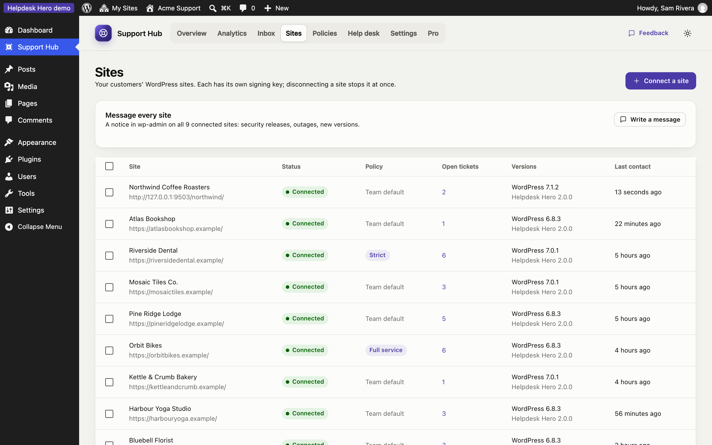
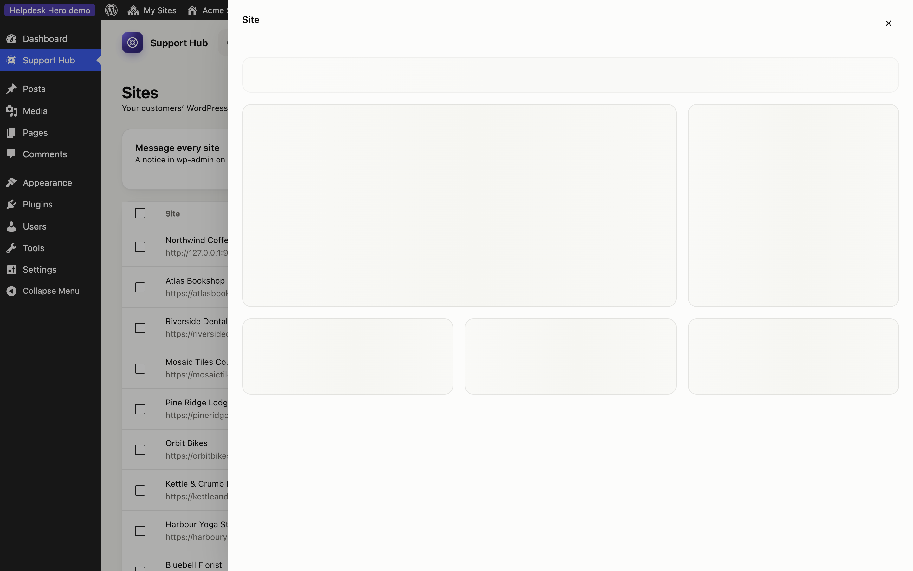

# Connecting sites

**Sites** lists every customer site connected to your hub, and the codes still waiting to be used.

For each site you see its status, the policy it uses, its WordPress and plugin versions, when it was last in touch with the hub, and its open tickets.

## Connect a site

1. Click **Connect a site**.
2. Enter a name for your records (usually the customer or the site) and, optionally, the customer's email.
3. Choose the site's policy: your default policy, a template, or edit it later.
4. Click **Create connection code** and send the code to the customer.

The code starts with `hdh1.`, can be used once and expires after 7 days. The customer installs **Helpdesk Hero** from WordPress.org, opens **Get Help** and pastes it. Until then, the site shows as **Waiting for the site** and you can copy the code again or cancel the invitation.

## A site's details

Click a site to open its panel.

- **Policy:** use your default policy, a [template](policies.md#templates), or custom rules for this site only. Changes reach the site within minutes.
- **Check connection:** sends a signed test request and tells you if the site answered.
- **Message:** shows a notice at the top of the customer's dashboard, with an optional button.
- **Tickets:** the site's recent tickets.
- **Disconnect:** ends the connection. Any active support access on that site ends too, and the customer's help center asks for a new code.

## Change many sites at once

Tick the sites you want in the list, then use **Bulk actions → Apply policy** to give them all the same template, your default policy, and so on. Use this when you introduce a new plan, for example moving all "Care plan" customers to the *Full service* template.

## When a site can't reach the hub

The customer plugin fetches updates every 10 minutes and the hub pushes them right away when it can. If a site has been silent for a while, check the connection from its panel. Common causes are a security plugin or firewall blocking the REST API, or the site moving to a new address. See [Troubleshooting](troubleshooting.md).
